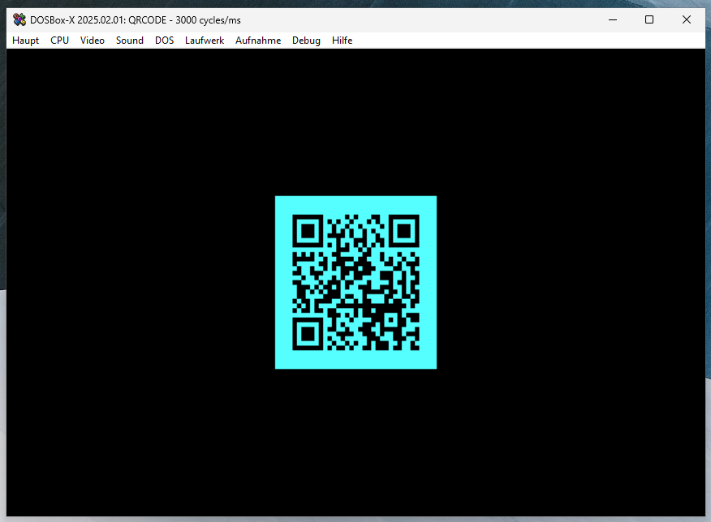
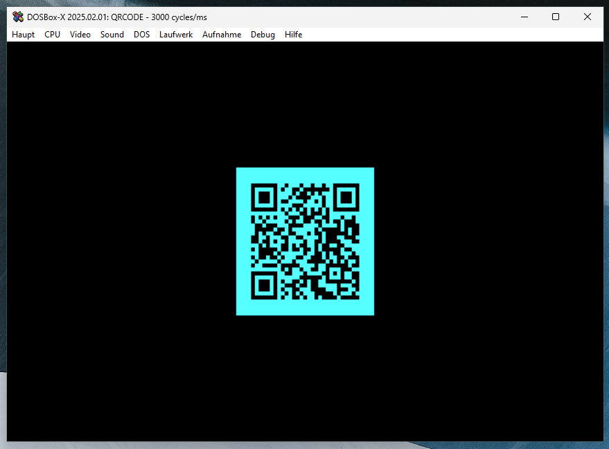
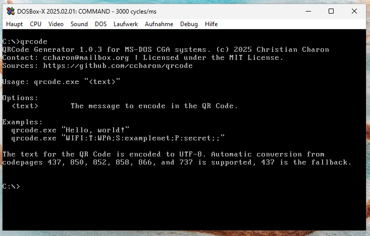

# QRCode - A MS-DOS QR Code Generator

This is a QR Code generator for MS-DOS. It requires an 8088 CPU and a CGA-compatible graphics card. The application is based on the C++ version of Nayuki's [QR Code generator](https://github.com/nayuki/QR-Code-generator), adapted to compile with Open Watcom 1.9 and run under MS-DOS (or DOSBox).

The project is meant as a demo for experimenting with QR code generation. For smaller QR codes, my NEC V20 takes about 15–20 seconds to generate one.

As QR codes require text to be in UTF-8, the input text is automatically converted from your system's codepage to UTF-8. Currently supported codepages are 850, 852, 858, 866, 737, and 437, with 437 as the fallback.

## Features
- Generates QR codes in CGA 320x200 mode.
- Supports UTF-8 encoding with automatic codepage conversion.
- Compatible with MS-DOS and DOSBox.

## Usage
Start the program with your text as an argument. If the text contains spaces, enclose it in double quotes.

### Examples

| C:\\>qrcode.exe "https://github.com/ccharon/qrcode"    |
| ----------------------------------------------------- |
|                     | 

| C:\\>qrcode.exe "WIFI:T:WPA;S:examplenet;P:secret;;"   |
| ----------------------------------------------------- |
|                     | 

| C:\\>qrcode.exe                                        |
| ----------------------------------------------------- |
|                      | 

## Project Setup
The project was built using Open Watcom 1.9 on Windows. To build the project:

1. Install the Open Watcom 1.9 compiler.
2. Clone this repository.
3. Run wmake to build the executable.

## License
This project is licensed under the MIT License. See the LICENSE file for details.
